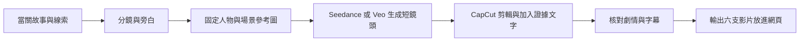

# 六關故事 AI 影片製作指南：Windows CapCut＋Seedance／Veo

整理日期：2026-09-26。適用故事：《消失的月蝕巧克力莓果千層蛋糕》。目標是製作放在目前網頁中的六支逐關影片。本文整理已討論的方法；尚未生成影片、購買方案或連接外掛，帳號實際可用模型仍待確認。

## 1. 工具如何分工

推薦以 Windows 版 CapCut 為主要工作區：先用帳號內可用的 Seedance 生成短鏡頭，再加旁白、證據文字與字幕。若沒有 Seedance，或特定動作反覆出錯，可用 Veo 比較相同鏡頭。這是減少工具切換的工作流程建議，不是模型品質排名。

| 名稱 | 白話理解 | 在本案中的用途 |
|---|---|---|
| Seedance | 依文字與參考素材拍出畫面的 AI 攝影師 | 開冰箱、移動蛋糕、提保冷袋等短鏡頭 |
| Veo | Google 的影片生成模型，另一位 AI 攝影師 | 生成故事鏡頭，作為替代或比較方案 |
| CapCut | 剪接室 | 排鏡頭、旁白、字幕、證據畫面，輸出成片 |
| Skill | 給 AI 助手的工作手冊 | 協助準備素材、剪輯與驗證；不等於模型、帳號權限或免費額度 |

CapCut 官方已介紹 Seedance 整合，以及電腦版 Veo 3.1 的使用方式；但功能依帳號、地區與版本分批開放，不能保證每個人看到相同選單。[Seedance 公告](https://www.capcut.com/newsroom/dreamina-seedance-2)、[AI 影片教學](https://www.capcut.com/tools/ai-video)、[桌面功能開放說明](https://www.capcut.com/help/find-ai-video-maker-in-capcut-desktop)

備援方案：在 [Dreamina](https://dreamina.capcut.com/tools/seedance-2-0) 或 [Google Flow](https://support.google.com/flow/answer/16353334?hl=en) 生成，下載後回 CapCut 剪輯。Flow 可用人物／物件參考圖，或指定起始與結束畫面；可用功能依模型而異。若動態素材始終不穩，可採靜態分鏡加緩慢推近與旁白，減少重做成本。

## 2. 製作流程全貌

### 步驟一：把一關拆成鏡頭

「分鏡」就是拍攝清單，每個鏡頭記錄畫面、旁白、要交代的線索，以及不能提前揭露的內容。第一關可拆成公共廚房、存放蛋糕、發現空櫃、六禾伸手的片段、系統紀錄。短動作先抓約4–8秒作為規劃起點，並非所有模型的固定生成長度；證據文字依閱讀時間停留。先做一关樣片，再延伸六關。

| 鏡頭 | 畫面 | 旁白／文字 | 必須保留的限制 |
|---|---|---|---|
| 第一關示例 | 六禾開冰箱，手伸向下層，冰箱門遮住取物位置 | 羅四影交出一段十二秒影片 | 不能看見六禾拿出蛋糕；這只是十二秒片段中的一個鏡頭 |

### 步驟二：先固定參考圖，再讓圖片動起來

「參考圖」像演員定裝照，讓模型沿用人物、服裝和道具。先確認六名角色外觀，再固定廚房格局、B-9位置、蛋糕盒、保冷袋、平板、氣泡水與橘色貼紙。可沿用網站角色圖作候選參考。同一晚的衣服與物品位置要連貫，不能讓生成誤差變成學生眼中的新線索。

### 步驟三：一次生成一個清楚動作

先做開門、伸手或移盒等單一動作，再剪接。避免第一輪就要求六人同時對話、取物、轉身與換鏡。提示詞可以採「參考素材＋場景＋視角＋動作＋結束狀態＋限制」的格式，例如：

> 使用參考圖中的人物、服裝與廚房。固定走廊視角，中景。人物打開冰箱，手伸向被門遮住的下層。畫面停在取物尚不可見的位置。維持相同場景與道具；無對白、無字幕、無配樂。

這是第一關某個鏡頭的示例，不是整關腳本。生成後逐鏡檢查；若AI補出「拿蛋糕離開」，即使畫面漂亮也不能使用。提示詞不能取代成品檢查。

### 步驟四：在 CapCut 組成一關

「時間軸」就是依播放時間排列影片、聲音和文字的工作區。先排旁白，再對應鏡頭，方便控制敘事與閱讀時間。姓名、B-9、22:47:09、重量與群組訊息等精確文字，在剪輯時加入並逐字校對。旁白可自行錄音，或使用CapCut文字轉語音，再產生字幕並修正人名與讀音。[文字轉語音](https://www.capcut.com/tools/ai-voice-generator-pc)、[字幕教學](https://www.capcut.com/resource/how-to-add-subtitle-in-capcut)

建議採中性旁白與調查紀錄片形式。角色證詞留在網頁閱讀／訊問，影片只交代當關新線索；避免用誇張表情、配樂或鏡頭特寫替學生暗示誰有罪。

### 步驟五：第一關與第四關一起規劃

兩關呈現同一件冰箱事件：第一關是不完整片段，第四關補足獨立證據。共用場景與動作素材，檢查人物服裝、門向、道具及位置能否接續。第四關的「幾分鐘後」要另切鏡頭，不塞進消失的31秒裡。

### 步驟六：驗收與輸出

- 故事：時間、姓名、物品位置與動作符合當關腳本；區分角色說法、指控與獨立證據。
- 揭露：第一關不拍六禾拿出蛋糕；第三關不拍五澄本人改系統；第五關不把同品牌外盒直接認定為失物；第六關揭露共同分食，但不直接提供分類答案。
- 觀看：旁白清楚、字幕人名正確、證據畫面停留足夠，手機上也能讀懂；必要線索不只靠聲音傳達。
- 研究：兩組沿用相同影片、字幕、音量與觀看規則，避免額外增加組間差異。
- 格式：沿用[網站影片規格](../media/README.txt)，橫式16:9、1920×1080以上、24fps以上、MP4 H.264／AAC；輸出後檢查網頁播放。H.264／AAC即常用的影片與音訊編碼格式。
- 檔名：`media/intro-L1.mp4`至`media/intro-L6.mp4`。`intro-guide.mp4`是另一支開場操作說明，不混入完整真相。正式素材上線前保留試播檔備份，並驗證各關載入正確影片。

## 3. Skills 與自動化選項

| Skill／整合 | 能協助什麼 | 目前狀態與取捨 |
|---|---|---|
| imagegen | 人物、場景、分鏡參考圖 | 本機已有技能；適合前期素材，不直接產生動態影片 |
| video-use | 依指示剪輯現有影片、處理字幕與聲音 | 本機已有技能；仍需確認執行環境及素材，部分流程可能用付費服務 |
| Remotion 官方 skills | 精確的系統紀錄、時間軸、群組訊息動畫 | 可由AI寫程式製作；本輪未安裝，使用者不必先學程式 |
| CapCut × Codex | 官方描述可透過對話產生草稿、調整鏡頭與文字時間 | 本輪未連接或實測；找到官方整合不代表目前對話已能操作CapCut |

可參考[Remotion官方skills文件](https://www.remotion.dev/docs/ai/skills)與[CapCut × Codex官方介紹](https://www.capcut.com/tools/capcut-x-codex)。第一支樣片可先直接在CapCut完成，不必先安裝所有工具。

## 4. 費用與試做方式

CapCut訂閱與AI生成點數是不同機制，不能把Pro理解成無限生成。以帳號生成前顯示的扣點與方案為準，不依行銷頁「免費」字樣估算整個專案。[官方點數說明](https://www.capcut.com/help/buy-pro-plans)

先測一個開冰箱鏡頭，記錄模型名稱、提示詞、參考圖、扣點、生成次數與可用結果。若動作不正確，先簡化動作或調整参考圖；仍不行才用另一模型比較。依實際成功率估算六關成本，不先同時購買多套訂閱。

## 5. 現在的第一個操作

在Windows CapCut編輯畫面找到「媒體 Media → AI媒體 AI Media → AI影片 AI Video」，查看模型選單。不同版本可能直接把入口放在左側AI媒體區。[官方電腦版路徑](https://www.capcut.com/tools/seedance-1-5-ai-video-generator)

預期看到「文字生成影片／圖片生成影片」與模型選擇。先記下可用模型名稱即可，不必立即生成或付費；不要在對話貼登入驗證碼或付款資料。確認實際介面後，再逐步操作第一個鏡頭，不照不同版本的截圖盲點。

## 6. 本案尚待處理

正式六關影片尚未製作；目前試播素材不能作為正式故事驗收。製片前需對齊AI角色補充回答的揭露順序、第三關「原始檔」稱呼，以及第一／四關的證據連貫性。詳見[故事內容核對報告](testing/2026-09-26-story-video-audit.md)。本文是製作方法與驗收清單，不代表已測過付費模型、帳號權限或正式影片成品。
