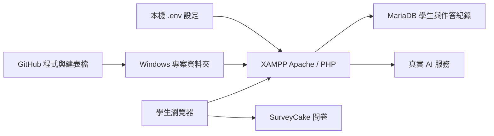

# Windows XAMPP 安裝與搬機

本版已用 PHP 8.2.12、Apache 2.4、MariaDB 10.4.32 的 Linux 容器執行完整測試；**尚未在 Windows 真機執行**。這些 PHP／MariaDB 版本對應 [XAMPP Windows 8.2.12 的官方套件](https://www.apachefriends.org/download.html?lan=english)。詳細證據見 [測試報告](testing/2026-09-26-xampp.md)。

GitHub 帶的是程式、建表檔和試播影片；資料庫裡的學生紀錄、`.env` 金鑰與電腦上的 Apache 設定不會隨 git pull 搬過來。



## 1. 拉取程式

以下安裝範例以 Windows **命令提示字元 cmd.exe**、XAMPP 在 `C:\xampp`、專案在 `C:\xampp\htdocs\idealight_sdg` 為例。若實際路徑不同，替換路徑。先保留自己尚未提交的修改；有衝突時不要強制覆蓋。

```bat
cd /d C:\xampp\htdocs\idealight_sdg
git pull origin main
C:\xampp\php\php.exe -v
C:\xampp\mysql\bin\mysql.exe --version
```

網站需要 PHP 的 `pdo_mysql`、`curl`、`openssl`、`mbstring`。可用 `php.exe -m` 查看。一般使用網站不需要 Node；只有執行開發測試才需要。

## 2. 讓專案成為網站根目錄

在 XAMPP 的 Apache 設定 `httpd.conf`，將現有的 DocumentRoot 與對應 Directory 路徑改為此專案。DocumentRoot 就是網址 `/` 對到的資料夾，像網站的門牌；本系統的 `/api/...` 都從這裡找。

```apache
DocumentRoot "C:/xampp/htdocs/idealight_sdg"
<Directory "C:/xampp/htdocs/idealight_sdg">
    AllowOverride All
    Require all granted
</Directory>
```

儲存後重啟 Apache，並啟動 MySQL。以 `http://localhost/` 開啟，**不是** `http://localhost/idealight_sdg/`。如果此 Apache 已服務其他網站，改用獨立 VirtualHost，避免改動既有網站的根目錄。`AllowOverride All` 讓專案的 `.htaccess` 存取規則生效。

## 3. 資料庫：全新與升級擇一

### 全新安裝，尚未收集學生資料

下列命令使用 XAMPP 本機 root 空密碼；如果已設定密碼，於 `-u root` 後加 `-p`，依提示輸入，不把密碼寫在指令或聊天中。

```bat
C:\xampp\mysql\bin\mysql.exe -u root < api\schema.sql
C:\xampp\mysql\bin\mysql.exe -u root < api\schema_cake.sql
C:\xampp\mysql\bin\mysql.exe -u root < api\seed_cake.sql
```

三個檔案會選用 `idealightsdg`。全新建表已改用 MySQL 與 MariaDB 都支援的中文字元排序設定 `utf8mb4_unicode_ci`；不是把既有學生資料重新轉碼。匯入後在 phpMyAdmin 應看到 `idealightsdg`，其中 `ck_levels` 有六關。

### 已有蛋糕實驗資料庫

先備份既有資料庫並確認備份可還原，再對**既有資料庫名稱**執行以下兩個新增表的遷移。這裡以 `idealightsdg` 為例；不要漏掉指令中的資料庫名稱。不要用全新安裝的 schema 混裝到舊資料庫。

```bat
C:\xampp\mysql\bin\mysql.exe -u root idealightsdg < api\migrations\2026_09_interrogation_chat.sql
C:\xampp\mysql\bin\mysql.exe -u root idealightsdg < api\migrations\2026_09_review.sql
```

遷移會沿用現有學生編號欄位的型別與文字排序設定；重複執行不應重設既有組別、草稿或作答。本輪用合成資料驗證過，但沒有接觸你的正式資料庫。

**把 Mac 上的既有研究資料搬到 Windows 是另一件事。** git pull 不會搬資料。若來源是 MySQL 8/9、備份含 `utf8mb4_0900_ai_ci`，MariaDB 10.4 無法直接匯入；不能只把備份文字全部取代後就當作搬移成功，必須在副本檢查欄位關聯、文字比較與紀錄一致性。保留來源備份，另做搬移驗證。來源開啟 GTID 時，MySQL 匯出另須考慮 `--set-gtid-purged=OFF`。本輪沒有搬移正式學生資料。

## 4. 設定這台電腦的連線

只在 `.env` 尚不存在時建立：

```bat
if not exist .env copy .env.example .env
```

用編輯器填入本機設定。預設 XAMPP 資料庫可使用：

```dotenv
DB_HOST=127.0.0.1
DB_NAME=idealightsdg
DB_USER=root
DB_PASS=
```

另外填入有效的 `LLM_API_KEY`、實際供應商的 `LLM_BASE_URL`／`LLM_MODEL` 和問卷網址。沿用原本已驗證的 AI 供應商設定，不要把自動測試的 `local-test` 或 `http://127.0.0.1:18080` 帶到試玩／施測環境。`.env` 不提交 GitHub，也不要貼進聊天。

若 PHP 錯誤紀錄顯示 cURL 憑證驗證失敗，檢查 `C:\xampp\php\php.ini` 的 `curl.cainfo` 是否指到有效 CA 憑證檔，再重啟 Apache；不要關閉 TLS 憑證驗證來繞過錯誤。

## 5. 準備目前的試播影片

目前依使用者要求，根目錄 `video.mp4` 作為共同試播來源。執行：

```bat
C:\xampp\php\php.exe api\tools\prepare_demo_media.php
```

它會在 `media` 建立開場及六關所需的七個**實體檔案**，不依賴 Windows 符號連結權限。已有檔案會保留。Git 只需攜帶一份來源影片；本機複製會多占七份空間。正式施測前須換成七支對應內容的正式影片。

## 6. Windows 真機最後驗收

開 `http://localhost/`，實際驗證：註冊登入、影片播完解鎖、兩組交替分派、角色回答與對話保存、重登接續、分類與理由共同提交、時間到保存未送出內容、六關完成後填問卷及顯示結果。確認控制組後測前看不到解析與分數。

另開 `/.env`、`/.ENV`、`/api/seed_cake.sql`、`/api/SEED_CAKE.SQL`、`/TESTS/helpers.mjs`、`/api/src/db.php`，都應是 403／404；若讀得到檔案，先修正 Apache 設定再提供學生使用。PHP 錯誤紀錄中不應有連線或 AI 錯誤。每個角色出現同一句固定測試台詞時，先查有沒有誤用模擬 AI 設定。

自動測試另見 [tests/README.md](../tests/README.md)，只能對隔離測試資料庫執行。真機驗收尚未完成前，結論是「相同伺服器版本測試通過」，不是「Windows 已驗收」。
